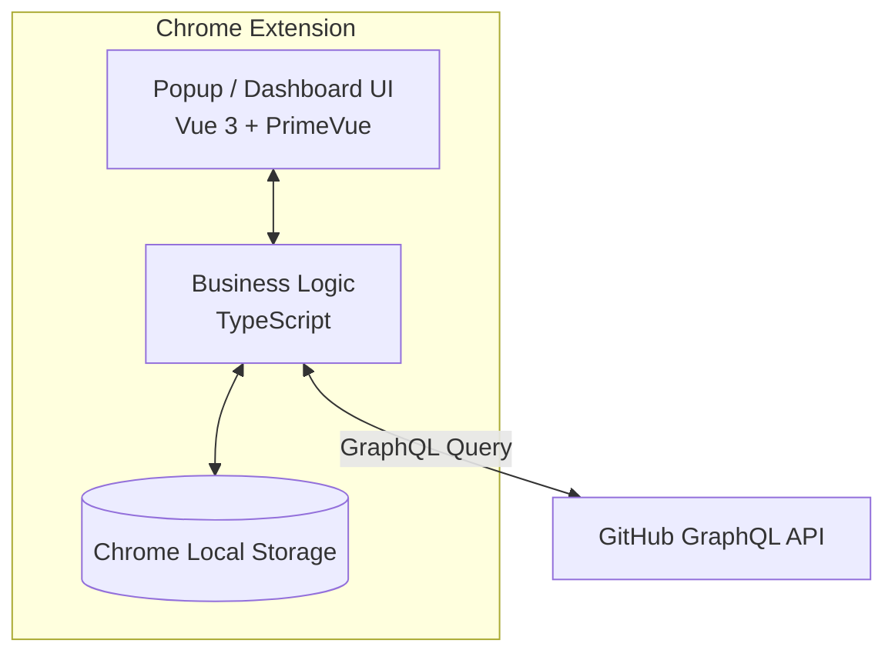

# FourSight システムアーキテクチャ設計

## 1. 概要
FourSightは、GitHubリポジトリのデータを分析し、Four Keys（DORAメトリクス）を自動算出して可視化するブラウザ拡張機能です。
外部のバックエンドサーバーを持たず、ブラウザ上で完結するセキュアなアーキテクチャを採用しています。

## 2. システム構成図

## 3. 主要技術スタック
- **フロントエンドフレームワーク**: Vue 3
- **UIライブラリ**: PrimeVue
- **グラフ描画**: Chart.js
- **言語**: TypeScript
- **ビルドツール**: Webpack

## 4. モジュール設計

### 4.1. プレゼンテーション層 (UI)
- メトリクスダッシュボード表示
- グラフ（Chart.js）を用いたアクティビティ推移の可視化
- 検索・フィルタリングUI（日付範囲、ブランチ等）
- 多言語対応（日本語・英語）の切り替え

### 4.2. アプリケーション層 (Business Logic)
- GitHub GraphQL APIとの通信管理・エラーハンドリング
- DORAメトリクス（DF, LTFC, CFR, TRRS）の計算ロジック
- アプリケーション全体の状態管理（State Management）

### 4.3. インフラ層 (Storage & API)
- **GitHub API**: Personal Access Tokenを利用したPull RequestやIssueデータの取得
- **Chrome Storage**: トークンや設定情報、選択中リポジトリなどの安全な保存
